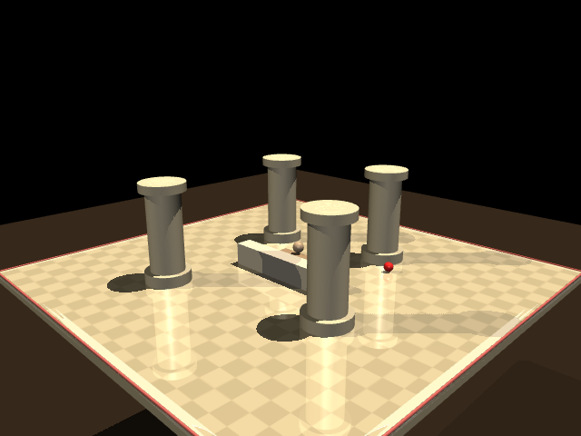

# Alien Baby

**Teaching AI the difference between the *word* "ball" and the thing you'd actually catch.**

*Searle's Chinese Room, translated to Greek. A language model without grounding manipulates symbols it doesn't understand, producing plausible output that refers to nothing. Alien Baby is the alternative — a creature that learns the thing before it ever hears the word.*

## The problem

AI agents hallucinate because their concepts were never anchored in anything. "Ball" to a language model is a token that co-occurs with other tokens. To a toddler, "ball" is what rolls, what you catch, what you failed to catch and had to chase under the couch. The word is the last layer, not the first.

Alien Baby is a perception-grounding experiment. A simulated creature learns concepts *before* language — through action, consequence, and survival — and we measure whether what it ends up with is the kind of thing language could later attach to.

## The setup

- A creature (torso + two arms + pan/tilt head with camera) lives on a 2m × 2m elevated platform.
- It's hungry. It has to find food — partly by feel, eventually by sight. Falling off the edge kills it.
- It learns in stages: **proprioception first** (groping in the dark, body before world), then **vision added** (seeing the world it already knew by touch).
- Gravity teaches it where edges are. Hunger teaches it to move. The physical world corrects its mistakes — no reward shaping, no human labels.

## If you only click one thing

→ **[FINDINGS.md](FINDINGS.md)** — the full experimental arc (v1–v8) with real numbers, failures, and what we learned from each.

## Headline result (v5)

We trained the creature to move by touch alone. Then we added vision. The question: does vision overwrite what touch already taught it, or does it get layered on top?

**Result: vision gets layered on top.** The touch-based internal representation survived the transition almost perfectly intact — the before-vision and after-vision versions of the creature think about touch inputs in 99.8% the same way. Vision was woven in, not substituted.

That layering — new senses extending the old ones rather than replacing them — is the property language will eventually need to attach to.

## What's in this directory

- `envs/` — MuJoCo environments: tabletop arm (v1–v7), platform creature (v8)
- `agents/` — training scripts, staged developmental RL (v1 through v8)
- `FINDINGS.md` — the experimental record
- `GLOSSARY.md` — quick definitions for the terms in FINDINGS
- `tests/` — evaluation scripts, including representation-similarity probes
- `visualization/` — render scripts that produce split-screen video (overhead + head cam)

## Status

Research experiment, not a library. Actively training. v8 (the platform creature with survival stakes) is running as of the submission date. Results land in FINDINGS as they come.

## Who this is for

Builders who've hit the hallucination wall and suspect that *more training on text* isn't going to fix it. This is an early piece of a grounding substrate — small-scale and obviously so — that agents could eventually hook into.
