# Alien Baby — Architectural Review

*A conceptual tour of the codebase for a reader who has not seen it before.*

This document is a self-contained architectural overview of the **alien_baby** project: what it is trying to prove, how the code is organised to prove it, and how the pieces fit together. It is written for a technical-leaning non-engineer — a research collaborator or theorist who wants to understand the experiment conceptually without reading the Python line by line. Where the architecture *is* the idea, short code snippets are included with file:line references.

It complements, rather than replaces, the sibling documents in `alien_baby/`:

- `README.md` — the one-page pitch.
- `FINDINGS.md` — the experimental record (what was run, what was measured).
- `PROJECT_STATUS.md` — the current-state snapshot (what is and isn't working right now).
- `GLOSSARY.md` — definitions of the 50+ technical terms the codebase uses.

This document's specific job is to make the **architecture legible**: the shape of the creature, the shape of its world, the shape of its learning machinery, and the shape of the research arc that produced them.

---

## Table of Contents

1. [Orientation: what this project is](#1-orientation-what-this-project-is)
2. [The theoretical frame: Taylor and grounding](#2-the-theoretical-frame-taylor-and-grounding)
3. [The creature and its world](#3-the-creature-and-its-world)
4. [The core architectural claim: interpenetration by construction](#4-the-core-architectural-claim-interpenetration-by-construction)
5. [The curriculum: staged development and survival grounding](#5-the-curriculum-staged-development-and-survival-grounding)
6. [The mirror wrapper (current active branch)](#6-the-mirror-wrapper-current-active-branch)
7. [How success is measured](#7-how-success-is-measured)
8. [Code layout and call graph](#8-code-layout-and-call-graph)
9. [Version evolution and the recurring pattern](#9-version-evolution-and-the-recurring-pattern)
10. [Glossary and further reading](#10-glossary-and-further-reading)

---

## 1. Orientation: what this project is

In one sentence: **alien_baby trains an embodied simulated creature so that its senses interpenetrate (Taylor's term) instead of stacking, with the downstream goal of producing a grounded sensory-motor substrate that a language model could later be attached to.**

Three framings that each catch a different face of the same project:

- **The RL framing.** A small wheeled creature on a platform has to find a ball. It has proprioception (feeling its own body) and optionally a head-mounted camera. It is trained with SAC (Soft Actor-Critic, a standard continuous-control reinforcement-learning algorithm) in MuJoCo, a physics simulator. All of that machinery is off-the-shelf.

- **The research framing.** The point is not to solve the task. The creature can solve the task by blindly paddling forward and hoping the ball is in front of it; the numbers confirm this. The point is to ask whether, when vision *is* added after proprioception is already established, vision ends up **woven into** the motor loop — or **bolted on top** of it as a separate, disconnected channel.

- **The grounding framing.** A language model that has only seen text knows the word "ball" only by its statistical company. Its concept of "ball" floats free of any equivalence class formed by catching, dropping, rolling, or bumping into actual balls. The long-term hypothesis of this project is that a pre-verbal perceptual substrate, formed by developmentally-staged embodied training, could give an LLM something to anchor its words to — in the same way an infant's first words attach to pre-verbal experience, not the other way around.

The architecture only makes sense in that third light. If the goal were "get the creature to touch the ball," the whole curriculum — freeze proprio, add vision, measure representational similarity, enforce a consistency loss — would be unmotivated over-engineering. The goal is structural: we want the creature's internal state, when it has learned to see, to still be recognisably **the same creature** that learned to feel. Vision should extend proprio's world, not replace it.

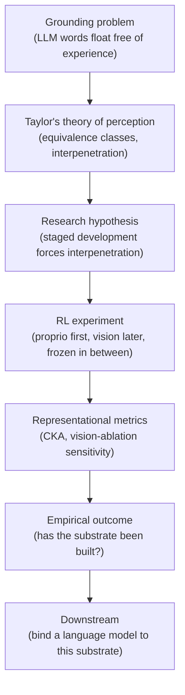

The rest of this document walks down that chain, from theory to code.

---

## 2. The theoretical frame: Taylor and grounding

The project's intellectual spine is Kenneth Taylor's *Behavioral Basis of Perception*. Three of its concepts do almost all of the work:

**Pi (the response set).** At any moment, an organism is prepared to execute some set of responses to its current sensory state. Taylor calls this set **Pi** (written with the Greek letter in the book). Pi is not a decision rule or a plan; it is simply the dispositional shape of "what this creature would do if things developed this way or that way, right now."

**Equivalence classes.** Two distinct sensory states are said to be *equivalent* for a given organism if the organism's response to them — its Pi — is the same. Critically, the equivalence is not a model the organism holds about the world. The equivalence *is* the perception. When a child sees-a-ball and feels-a-ball and responds to both with the same "reach-to-grasp" disposition, the child is perceiving a ball. There is no intermediate representation of ball-ness doing the work; there is only a response-pattern that treats both inputs as the same.

**Interpenetration (Chapter 5).** Senses develop in sequence, not in parallel. Touch and proprioception come before vision; vision comes before language. When a later sense arrives, a theory-faithful developmental story says it does not carve its own separate processing channel. It weaves into existing response pathways. The visual system of a seeing child is not glued on top of a fully-formed tactile system; it interpenetrates it. Seeing an apple and feeling an apple share circuitry because they came to share responses, from the ground up.

Taylor's claim translates into an empirical prediction: **if you train a second sense onto a first sense correctly, the first sense's internal representation should persist, not be overwritten.** The second sense should extend the first sense's manifold of activations; it should not carve out a new manifold that ignores the first. If you measured how similar the first sense's internal state is to itself before vs. after the second sense was added, the similarity should be high.

This is testable with neural networks. The alien_baby project does exactly this test, operationalising the theory as a curriculum, an architectural constraint, and a measurement. The user has noted (and this is worth recording) that the phrase **"world of classes"** — used elsewhere in their writing — is *their* coinage, not Taylor's.

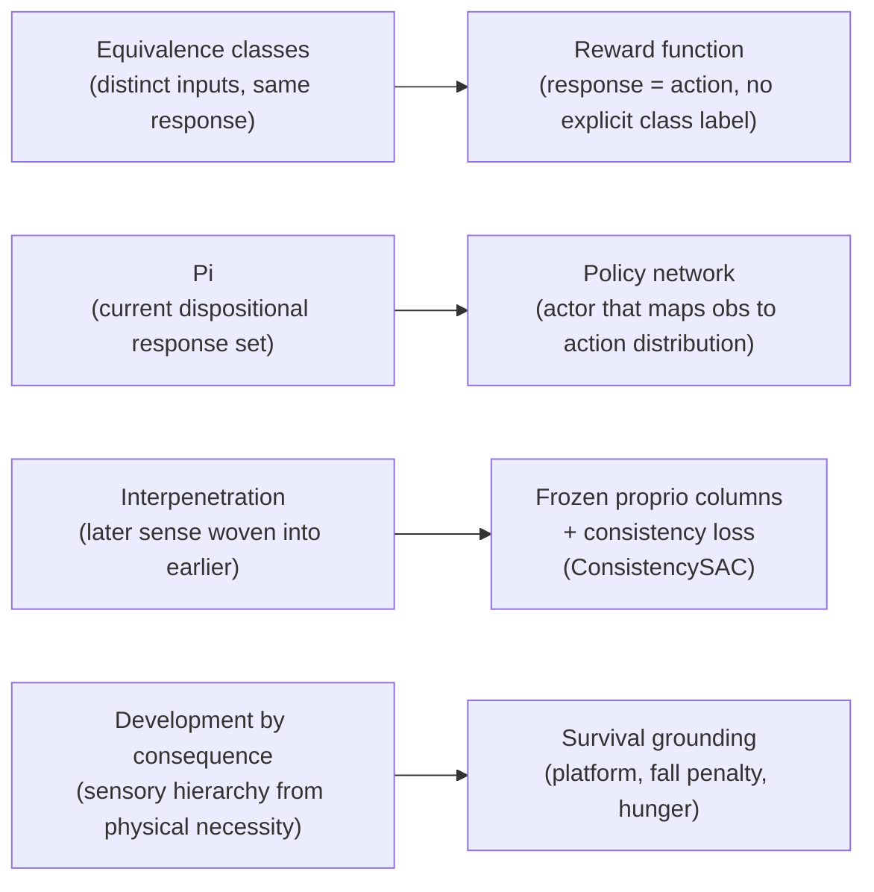

Three supporting files at the repository root expand this framing for a longer read:

- `alienbaby.md` — a long-form essay tying Taylor's theory to the RL experiment, written in the voice of the project itself.
- `On Agents.txt` — notes tying the same material to broader agent / storytelling theory.
- `alien_baby/docs/Alien Baby.docx` — the formal write-up.
- `alien_baby/docs/greek_room.png` — the project's Searle "Chinese Room" analogy, drawn as a Greek Room where the symbols are unbound equivalence classes rather than unbound words.

---

## 3. The creature and its world

When the reader watches a training video, this is what they are looking at.

### 3.1 The body

The creature is deliberately minimal. Every part exists because it is needed for the experiment; nothing is there as biological verisimilitude. The body is defined in `alien_baby/envs/platform_creature.xml` (v8) and `platform_creature_v9.xml` (v9, the current active variant).

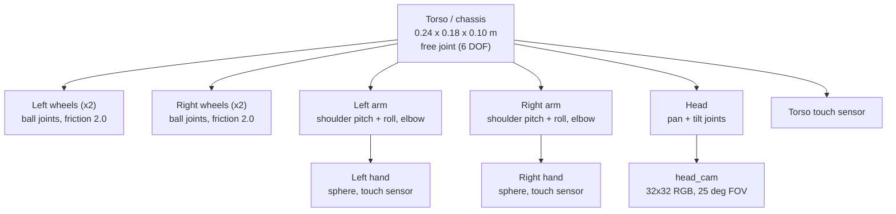

Four design choices in that diagram are worth naming, because each is the *product* of something that did not work earlier:

1. **Blocky chassis with a wheelbase wider than the chassis in every axis.** Earlier versions used a pancake torso with wheels at the corners; it was stable when tipped onto its edge and the creature ended up "on its back." The current chunky shape makes every non-bottom face of the torso elevate the wheels if it rests on it; tipping is no longer a stable attractor.
2. **Forward-pointing arms** (arms extend in +Y, not sideways). The shoulder has two rotational joints, pitch (Y-axis) and roll (X-axis). If the arm is aligned with X, the roll joint rotates the arm around its own axis and does nothing useful. If the arm points forward, the roll joint swings the arm in the Y-Z plane — a natural rowboat paddle stroke. This is the motion the creature learns.
3. **Head centered on the chassis.** An earlier design put the head slightly forward (`y=0.08`). The resulting fore-aft mass asymmetry caused every trained policy to move strictly *backward*, because pushing the arms forward was mechanically easier. Centering the head removed the asymmetry.
4. **Weak, short arms.** Shoulder torque is 15 Nm, elbow 10 Nm, total arm reach ~0.22 m. This is on purpose. Strong arms could lever the 3.6 kg chassis off its wheels. Baby arms cannot. The creature's disposition to flip itself over is neutralised not by the controller but by the body.

These are not minor decisions. They are the difference between a body the policy can learn through, and a body the policy would have to fight. `PROJECT_STATUS.md` records six of these failure modes as chronological lessons.

### 3.2 The world

The world is a 2 m × 2 m elevated platform, 2 m above an infinite floor. A red ball, 4 cm in radius, sits somewhere on the platform at episode start. The floor is not decorative: falling off is how the episode ends badly.

Taylor's framework asks: *what is the pencil tap — the ever-present physical condition against which the organism forms equivalence classes?* Here the answer is gravity. Gravity is not a reward term; it is not mentioned in the reward function at all. It is just the environment's prior, always present. When the creature approaches the edge, the drop is real. When it over-paddles, it falls. The consequence of falling is simply the loss of all future reward. The **design philosophy is pressure, not bribery** — the environment is shaped so the desired behavior is instrumental to survival, rather than paid for directly.

### 3.3 What the creature senses

The creature's observation is a single flat vector. If vision is off, it has 29 dimensions; if vision is on, 3072 more are appended.

**Proprioception (29 dims).** Assembled in `_get_proprio()`:

```python
# platform_creature_env.py:233-258
def _get_proprio(self):
    sd = self.data.sensordata
    arm_pos = sd[0:6].copy()     # 6 arm joint positions
    arm_vel = sd[6:12].copy()    # 6 arm joint velocities
    head_pos = sd[12:14].copy()  # 2 head joint positions (pan, tilt)
    touch = sd[14:17].copy()     # 3 touch sensors (left hand, right hand, torso)

    torso_quat = self.data.qpos[3:7].copy()     # 4 torso orientation
    torso_vel = self.data.qvel[0:3].copy()      # 3 torso linear velocity
    torso_angvel = self.data.qvel[3:6].copy()   # 3 torso angular velocity
    torso_xy = self.data.xpos[self._torso_id][:2].copy()  # 2 xy on platform

    return np.concatenate([
        arm_pos, arm_vel, head_pos,
        torso_quat, torso_vel, torso_angvel,
        touch, torso_xy,
    ]).astype(np.float32)
```

Notice what is **not** in there: no ball position, no target vector, no distance-to-goal. The creature has no direct sense of where the ball is. In blind mode it has to discover the ball through touch. In vision mode it has to see it.

**Vision (optional 3072 dims).** If the creature has "eyes," the head camera renders a 32x32 RGB image at every environment step and flattens it into 3072 float values (each in [0, 1]). The vector is concatenated onto the proprioception vector. The camera has a narrow 25-degree field of view and is biased 30 degrees downward so that in the default head pose it can see the platform top and the ball if the ball is roughly in front of the creature.

### 3.4 What the creature can do

The action space is 8 continuous values in [-1, 1]: six arm motor commands (shoulder-pitch, shoulder-roll, elbow, for each side) and two head commands (pan, tilt). Arms are torque-controlled; head is position-controlled.

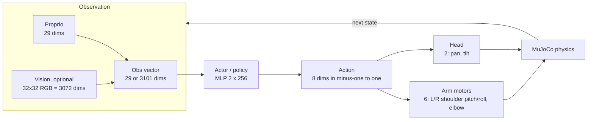

---

## 4. The core architectural claim: interpenetration by construction

This section is the most important part of the document. It is where Taylor's theory meets the neural network.

### 4.1 What went wrong first

The earliest staged experiment (v1, on a simpler tabletop arm) trained proprioception, then added vision and let SAC train every actor weight. The team then measured **CKA** — *Centered Kernel Alignment*, a standard similarity measure between hidden-layer activations — between the actor's first hidden layer before vision was added and the same layer after. They computed CKA on proprioception-only inputs, asking: does the network still respond to proprio the same way it used to?

The answer was **CKA = 0.033**, on a scale from 0 (completely different) to 1 (identical). Training vision had almost entirely rewritten the proprioceptive representation. The original team framed this as *evidence of interpenetration* — the representations had changed, therefore vision had woven in.

Closer reading of Taylor's Chapter 5 reversed the interpretation. "Properties of the perceptual field determined by one set of senses are incorporated in the perceptual field determined by the other set" — *incorporated*, not *overwritten*. CKA = 0.033 is not interpenetration; it is obliteration. A theory-faithful result should show the *earlier* sense's structure preserved, with the later sense layered on top of it.

`FINDINGS.md` documents this reinterpretation explicitly, and v5 was built as the corrective architecture.

### 4.2 The v5 mechanism: frozen proprio + consistency loss

v5 introduced two architectural commitments that all later versions still use.

**Commitment 1: freeze proprioception's columns of the first layer.** The actor is a two-layer MLP. Its first layer multiplies the observation vector by a weight matrix; the columns of that matrix correspond to the 29 proprioceptive input dimensions and the 3072 vision dimensions. During vision-added training, the proprio columns are mathematically prevented from changing — a gradient mask zeroes out the gradient signal on those columns. Only the vision columns train. The rest of the network's weights are also frozen. Vision can only modify where the vision signals go; it cannot retune how proprio was used.

```python
# train_v8.py:513-516
proprio_cols_snapshot = first_layer_weight.data[:, :PROPRIO_DIM_V8].clone()
mask = torch.ones_like(first_layer_weight)
mask[:, :PROPRIO_DIM_V8] = 0.0
first_layer_weight.register_hook(lambda grad: grad * mask)
```

That hook is the architectural constraint. Every time the gradient flows into the first layer, it is multiplied element-wise by a mask whose proprio columns are zero. The proprio weights are literally non-negotiable.

**Commitment 2: a consistency loss that pulls full-obs hidden activations toward blind-obs hidden activations.** At every training step, two forward passes are run through the actor: one with the full observation, one with the vision columns zeroed. The hidden-1 activations from the two passes are compared with mean-squared error, and that MSE is added to the actor's loss with a weight `lambda_consistency`.

```python
# train_v5.py:105-113
obs = replay_data.observations
obs_blind = obs.clone()
obs_blind[:, self.proprio_dim:] = 0.0
h_full = self._hidden1(obs)
h_blind = self._hidden1(obs_blind)
consistency_loss = F.mse_loss(h_full, h_blind)

actor_loss = actor_base_loss + self.lambda_consistency * consistency_loss
```

This is the whole of the consistency-loss mechanism. A single extra line in the actor loss. Read plainly, it says: *however vision ends up using the network, the network's hidden-1 state had better look very similar to what it would have looked like if vision had been absent*. Vision cannot steer the hidden state away from proprio's manifold. It can only confirm or fine-tune within it.

### 4.3 Why this is Taylor-faithful

The two commitments above are not regularisers dropped in for stability. They are the theory translated into code:

- Proprio established itself first, through training without vision. The frozen columns say: that establishment is protected. A new sense cannot rewrite an earlier sense's response pattern.
- The consistency loss says: the new sense's contribution must land on the earlier sense's manifold of activations. If vision pushed the hidden state somewhere proprio alone would never have gone, it would be bolted on, not woven in.
- The network architecture (pixels concatenated directly into the same MLP as proprio, no separate vision encoder) leaves vision no escape route. There is no parallel channel for vision to grow in. Any contribution it makes is through the shared hidden state.

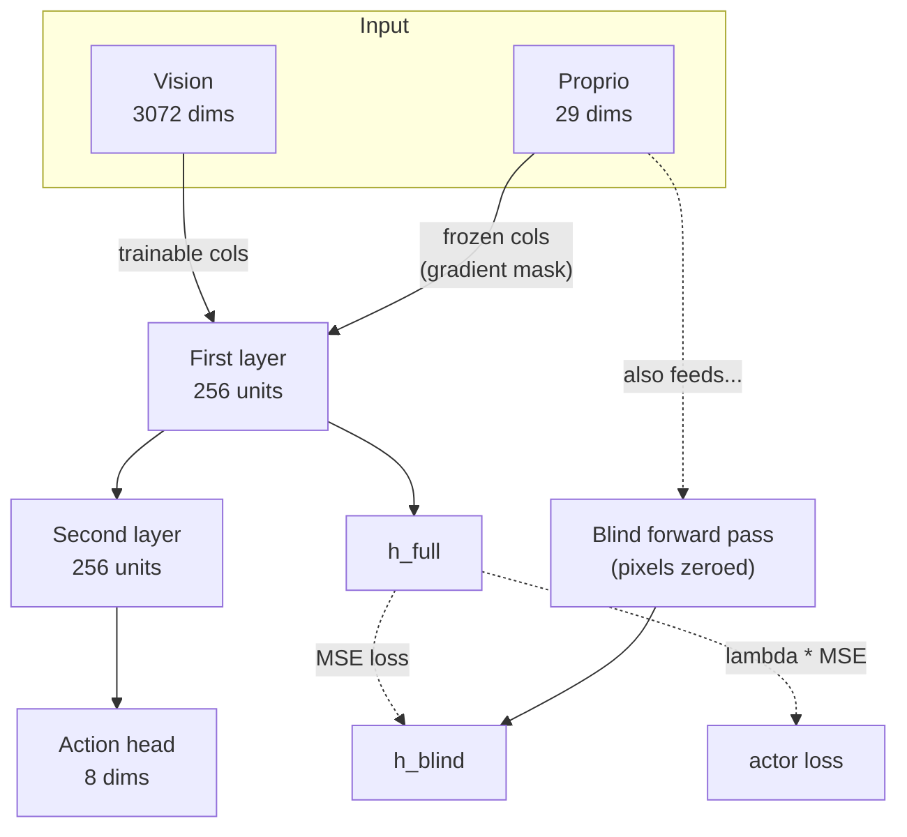

The result on the v5 tabletop task was CKA = **0.998** between stage-1 hidden-1 activations and stage-2 hidden-1 activations on proprio-only inputs. Vision had been added, and the proprio manifold had barely moved. In v6 (gaze camera) the preservation held at CKA = 0.992. That is the mechanism that, as of this writing, is still running in v8 and v9.

### 4.4 The gap

The v5 headline — "interpenetration demonstrated at 0.998" — is real, on the tabletop task it was measured on. The open question, which the later sections of this document surface, is whether the same mechanism keeps working as the task becomes harder. v8 applies the same architecture to a survival-grounded platform creature. Vision-ablation sensitivity there is currently about 0.17 — vision is present in the observation, it conditions the action a little, but it is not load-bearing. The creature is still solving by forward-paddling. Section 9 returns to this pattern.

---

## 5. The curriculum: staged development and survival grounding

Taylor's theory says senses should develop in sequence. The code turns that into a training schedule.

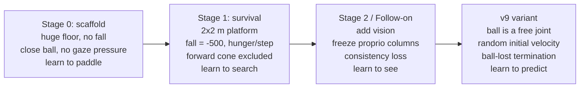

What is *kept* from one stage to the next is the critical point. Stage 1 inherits the paddle policy from Stage 0. Stage 2 inherits Stage 1's frozen proprio weights plus Stage 0's and Stage 1's physics. The developmental story is not "throw away and retrain"; it is "build on top."

### 5.1 Stage 0 — scaffold

Purpose: let proprio discover locomotion in an environment where nothing else is pulling at it. The platform is blown up to 10 m × 10 m (no meaningful edge), the fall penalty and edge warning are off, the target ball spawns close (0.4–0.55 m) and somewhere random in the full circle around the creature, and episodes are long (400 steps = 20 simulated seconds). The creature learns to roll forward and paddle; it does not need to worry about anything else yet.

### 5.2 Stage 1 — survival

The real alien_baby environment. Platform is 2 m × 2 m. Falling off costs -500 reward and ends the episode. A per-step hunger penalty of -0.05 pushes the creature to act. An edge warning within 0.3 m of the platform boundary costs up to -0.5 per step. Target ball spawns between 0.2 m and 0.7 m, anywhere in a full circle around the creature except a ±25-degree forward cone — the "gaze-pressure" exclusion, which means the creature must turn its head to see the ball (if it has vision). Episodes are 300 steps (15 sim-seconds).

The reward function is compact. Here is the full body of the per-step reward, condensed from `platform_creature_env.py:step()`:

```python
# platform_creature_env.py, reward block (approximate, condensed from lines 475-503)
reward += HUNGER_PENALTY                         # -0.05 per step
if self._closure_bonus_scale > 0.0:              # optional: direct reward for
    delta_closed = self._prev_body_dist - curr_body_dist
    reward += self._closure_bonus_scale * max(0.0, delta_closed)   #   approaching
if self._edge_warn_dist > 0 and edge_dist < self._edge_warn_dist:  # edge warning
    reward += self._edge_warn_penalty * (1.0 - edge_dist / self._edge_warn_dist)
attract = ATTRACT_SCALE * max(0.0, 1.0 - curr_dist / ATTRACT_MAX_DIST)  # last 0.25 m
reward += attract
if self._check_target_contact():                 # found it
    reward += CONTACT_REWARD                     # +200, terminate
if self._has_fallen():                           # fell off
    reward = self._fall_penalty                  # -500, terminate
```

Five meaningful components: hunger (tempo pressure), edge warning (boundary awareness), attract (a shallow "smelling the food" gradient only active in the last 0.25 m), contact (+200 for success), fall (-500 for failure). An optional "closure bonus" pays per-step for actually reducing distance (used in some experiments), and an optional potential-based shaping term `pbrs_alpha` can dense the gradient further. The default settings rely on contact, fall, hunger, and attract only.

No reward pays for turning the head. No reward pays for keeping the ball in the camera frame. **No reward pays for "using vision."** If the creature uses vision, it will be because vision became the only way to get the contact reward — not because the reward directly encouraged it. That is the difference between **pressure** and **bribery**, and the user has codified it as a project rule.

### 5.3 Stage 2 / follow-on — add vision

Seed the network from the Stage 1 checkpoint, then add vision, freeze the proprio columns, and train with the consistency loss (as described in section 4). The episode structure and reward function are unchanged. The creature now has extra inputs (3072 pixels), but the task and the platform are the same. This is the stage whose outcome Taylor's theory is being tested against.

### 5.4 v9 — moving ball

The current variant, on branch `feature/mirror-wrapper`. In v9 the ball is a free joint — it can be rotated and translated in all six degrees of freedom — and can be given an initial velocity and roll. It can fall off the platform, in which case the episode ends with no touch credit and no explicit penalty (the lost future reward *is* the pressure). Velocity decays with a 5-second half-life so the ball eventually sits still.

The point of v9 is to break the blind-paddle equilibrium. In v8, a creature that paddles forward at 7 cm/s hits the ball roughly one out of three times just by luck: the ball is static, and one-third of its possible spawn angles are within the paddle's forward cone. In v9 the ball is moving, so a fixed-direction paddle cannot reliably arrive where the ball will be. Vision becomes *instrumentally* necessary. This is what "pressure, not bribery" looks like in environment design.

v9 also pins the spawn radius to 0.5 m (to keep timing predictable for bootstrap) and randomises the torso's yaw at reset, so "arm action → world rotation" is decoupled and vision is the only signal the policy can use to work out which arm to push. Both choices are about making vision load-bearing without paying for it.

---

## 6. The mirror wrapper (current active branch)

This section describes the work-in-progress on branch `feature/mirror-wrapper`. The user has flagged it as architecturally important and suspects (reasonably) that symmetry augmentation should have been present from the start; a later conversation will address whether the standard locomotion-RL literature already treats this as given.

### 6.1 The problem

When the creature trains from scratch on Stage 1 with proprioception only, its learned policy tends to collapse into a **lateralisation attractor**. It learns to solve the right hemisphere but not the left, or the left but not the right. Hemisphere-balance probes (`spawn_hemisphere_probe.py`) reveal the asymmetry bluntly: touched_right_frac of 60%, touched_left_frac of 5%, or vice versa.

This is not a bug in the reward. The environment is symmetric — the ball can spawn on either side — and the creature's body is symmetric across the sagittal plane. What is not symmetric is the training history: SAC's random initialisation tips it toward one side, and the policy then self-reinforces along whichever side it first got rewarded on.

### 6.2 The symmetry argument

The creature and the environment are mirror-symmetric across the x = 0 plane. For every valid trajectory the creature could execute, there exists a mirror-image trajectory, under identical physics, that is equally valid. The mirrored trajectory uses the right arm where the original used the left, sees the ball on the right side of the head cam where the original saw it on the left, and so on.

If the policy could be exposed to both hemispheres of experience with equal weight, the attractor would dissolve. The mirror wrapper produces that exposure.

### 6.3 How the wrapper works

The key insight is that **no physics state needs to be mirrored**. The environment already produces mirror-symmetric trajectories on its own, given mirror-symmetric actions. The wrapper only has to make the *policy* see mirrored versions of some episodes.

At episode reset, the wrapper flips a coin (default probability 0.5). If heads, the episode plays in the "mirrored" frame from the policy's perspective.

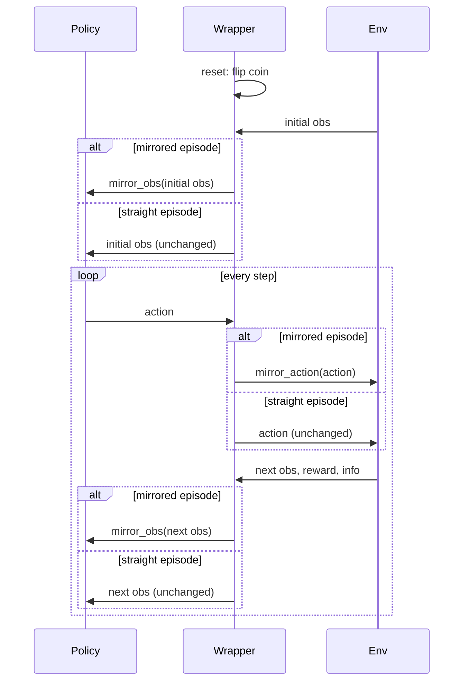

The `mirror_action` function is the whole argument in eight lines:

```python
# envs/mirror_wrapper.py:47-54
def mirror_action(action):
    """Mirror-invert an action vector. Involution: mirror(mirror(a)) == a."""
    a = np.asarray(action, dtype=np.float32).copy()
    left = a[0:3].copy()
    a[0:3] = a[3:6]      # swap left arm and right arm
    a[3:6] = left
    a[6] = -a[6]         # head pan: rotate around Z, so mirror negates it
    return a             # head tilt (a[7]): rotates around X, unchanged
```

`mirror_obs` does the analogous work on the 29-dimensional proprio vector plus the optional 3072 vision pixels. The physically meaningful sign flips — quaternion components y and z, linear velocity vx, angular velocity omega-y and omega-z, torso x position — are each a handful of lines:

```python
# envs/mirror_wrapper.py:70-77 (excerpt from mirror_obs)
# head_pan negate, head_tilt unchanged
o[12] = -o[12]
# Quaternion (w,x,y,z) at [14:18] -> (w,x,-y,-z)
o[16] = -o[16]
o[17] = -o[17]
# Linear velocity [18:21]: vx flips
o[18] = -o[18]
# Angular velocity [21:24]: ωy, ωz flip
o[22] = -o[22]
o[23] = -o[23]
```

Vision pixels are handled by a single horizontal column flip of the 32 × 32 image.

Because the env is symmetric, mirroring the action on the way in and the observation on the way out produces a consistent "world B" experience for the policy without any state manipulation inside the env. The unit tests in `tests/test_mirror_wrapper.py` verify this end-to-end: running a zero-action rollout with `force_mirror=True` produces obs vectors that equal `mirror_obs(obs)` of the plain rollout, to floating-point precision, through 10 physics steps.

The wrapper also flips `info["spawn_angle"]` and `info["spawn_left"]` so that downstream telemetry (hemisphere-balance probes, training callbacks) reflects the side of space *the policy perceived*, not the underlying physical spawn.

### 6.4 Why it matters architecturally

The mirror wrapper is a data-augmentation device, but it is not cosmetic. It enforces a symmetry that the task already has mathematically but that the stochastic dynamics of SAC fail to respect. If the hypothesis is that the creature's responses should form equivalence classes over mirror-related inputs (reach-with-right-when-ball-is-on-right is the same kind of act as reach-with-left-when-ball-is-on-left), then forcing the policy to see both halves of the input distribution is the condition under which that equivalence can *be learned at all*. In that sense the wrapper is not only fixing a training pathology; it is putting the creature in a position to make Taylor's equivalence classes relational rather than lopsided.

---

## 7. How success is measured

The reader needs to know, before watching a training video, what would count as the hypothesis being supported. Raw task success ("did it touch the ball?") is the weakest of the three measurement levels, and taken alone it can mislead.

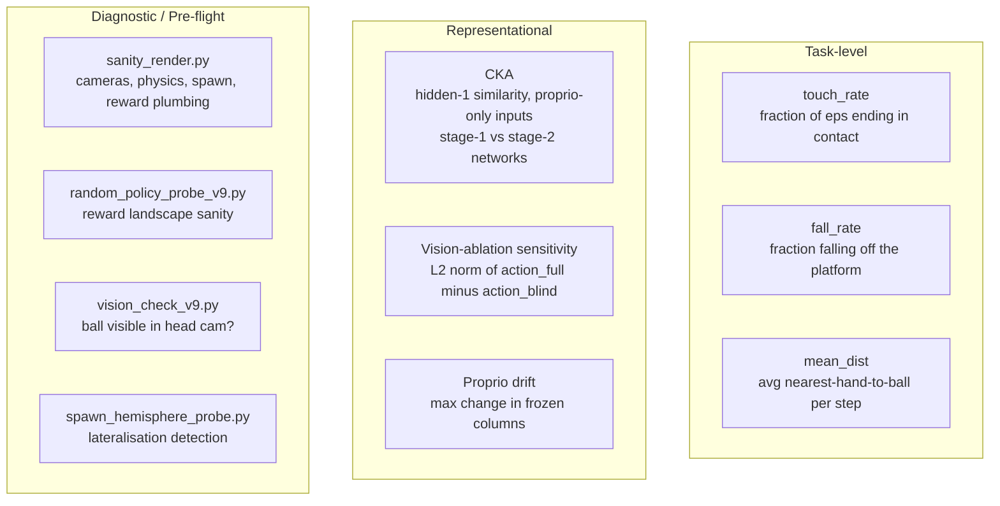

### 7.1 Task-level

- **touch_rate** — fraction of evaluation episodes that end in contact with the ball. Typical Stage 1 blind-proprio value: 7/20. A strong vision-added agent on v9 should break past that.
- **fall_rate** — fraction that end by falling off the platform. The current v8 body reports 0/20. The paddle-arm body design solved posture completely; the creature never falls any more.
- **mean_dist** — average nearest-hand-to-ball distance across the episode. Even when contact fails, a decreasing mean_dist across training is a signal that exploration is orienting toward the ball.

### 7.2 Representational

This is where the hypothesis actually lives.

- **CKA** (Centered Kernel Alignment) between stage-1 hidden-1 activations and stage-2 hidden-1 activations, evaluated on proprio-only inputs. This answers the Taylor question directly: after vision was added, is proprio still processed the way it used to be? v1 (broken) = 0.033. v5 (corrected mechanism) = 0.998. v6 (gaze camera) = 0.992. v8 has not yet been CKA-audited at the same resolution.
- **Vision-ablation sensitivity**, defined in `render_v8.py`:

```python
# visualization/render_v8.py:59-92 (summary)
def measure_vision_ablation_sensitivity(model, n_states=40, ...):
    # Collect 40 observations from a short rollout.
    # For each obs, compare the deterministic action under the full obs
    # to the deterministic action when the pixel columns are zeroed out.
    # Larger L2 distance = vision is load-bearing.
    # Near zero = vision is in the observation but not being used.
```

This is the single most important diagnostic for whether the theory's key prediction is *operative* in a trained model. A network can score high on task success while ignoring vision entirely; it can score high on CKA while integrating vision trivially. Vision-ablation sensitivity asks whether the policy would act differently if the pixels went dark. v8's current figure is about 0.17, which is low — the creature is looking, but it is not steering by what it sees.

- **Proprio drift**, the maximum absolute change in the frozen proprio weights across a training run. By construction (the gradient mask), this should be 0 to floating-point precision. It is printed at the end of every follow-on run as a safety check that the mask is actually wired up.

### 7.3 Diagnostic / pre-flight

These are not tests the code passes or fails. They are short scripts the operator runs *before* committing compute to a long training job, checking that the environment is sane.

- `sanity_render.py` — renders one short episode from whatever model is about to be trained (or a freshly-initialised random policy). The operator watches the video. If the cameras are black, the creature clips through the platform, the ball spawns inside the torso, or the reward signals do not fire, the training run is cancelled before it starts. The project's `CLAUDE.md` codifies this as mandatory for any run longer than 50K steps.
- `random_policy_probe_v9.py` — rolls 100 random-action episodes under the v9 reward and prints component sums. Verifies that hunger outweighs attract (net-idle is negative) and that random-policy touches are non-zero but rare (the task is hard but not impossible).
- `vision_check_v9.py` — counts red-ball pixels in the 32 × 32 head cam at reset across 50 seeds. Flags if the ball is invisible in more than 20% of spawns. If it is, the spawn radius is shrunk before training starts.
- `spawn_hemisphere_probe.py` — runs a trained checkpoint deterministically across many seeds and bins touch success by body-frame hemisphere. Detects the lateralisation attractor that motivates the mirror wrapper.

This diagnostic-first culture is worth naming as part of the architecture. The codebase is organised around the assumption that compute is expensive and silently-wrong environments are the biggest risk. The probe scripts are the pre-flight checklist.

---

## 8. Code layout and call graph

### 8.1 Directory tree

```
alien_baby/
├── agents/           training scripts, one per major version
│   ├── train_v5.py       tabletop: introduces ConsistencySAC
│   ├── train_v6.py       tabletop + gaze camera
│   ├── train_v7.py       tabletop + moving targets + narrow FOV
│   ├── train_v8.py       platform creature (current baseline)
│   ├── train_staged.py   shared staged-training plumbing
│   └── train_baselines.py
├── envs/             MuJoCo XMLs and gymnasium wrappers
│   ├── platform_creature.xml     v8 body + static target
│   ├── platform_creature_v9.xml  v9 body + free-joint target
│   ├── platform_creature_env.py  the main env (reward, obs, step, reset)
│   ├── mirror_wrapper.py         current active branch
│   ├── flatten_wrapper.py        flattens dict obs to vector (older code)
│   ├── tabletop.xml              v1 through v5 body (legacy)
│   └── tabletop_env.py           v1 through v5 env (legacy)
├── visualization/    video rendering
│   ├── render_v8.py              3-panel composite, vision-ablation measurement
│   ├── sanity_render.py          pre-training sanity check
│   └── render_episodes.py        shared frame-drawing utilities
├── tests/            unit tests and diagnostic probes
│   ├── test_mirror_wrapper.py    current active branch
│   ├── test_interpenetration.py  CKA / degradation / entanglement
│   ├── test_battery.py           equivalence / cross-modal / staged-vs-joint
│   ├── random_policy_probe_v9.py reward-landscape probe
│   ├── spawn_hemisphere_probe.py lateralisation probe
│   ├── vision_check_v9.py        ball visibility probe
│   └── evaluate_v5.py evaluate_v6.py evaluate_v7.py    legacy evals
├── results/          training outputs (checkpoints, logs, videos)
├── docs/             this document + Alien Baby.docx + greek_room.png
├── configs/          hyperparameter presets (sparse; most config is CLI)
├── FINDINGS.md       experimental record
├── PROJECT_STATUS.md current snapshot
├── GLOSSARY.md       term definitions
└── README.md         one-page pitch
```

### 8.2 Version and naming conventions

File suffixes (`_v5.py`, `_v8.py`, ...) mark the architectural iteration the file belongs to. Results folders follow the pattern `{stage}_v{N}_{config-tags}_{best|checkpoints|logs}`, for example `followon_v8_v9_anneal_030to050_best`. The tags compactly encode hyperparameters like PBRS alpha (`a010` = 0.1), target radius (`r050` = 0.5 m), and provenance (`scratch`, `from_stage1`). The README and FINDINGS files describe each version's headline claim.

### 8.3 Training entry point call graph

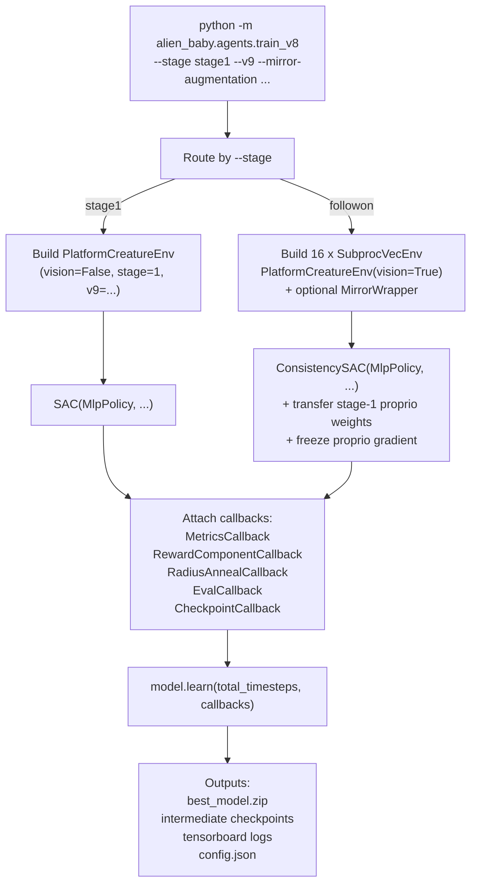

### 8.4 env.step() internal flow

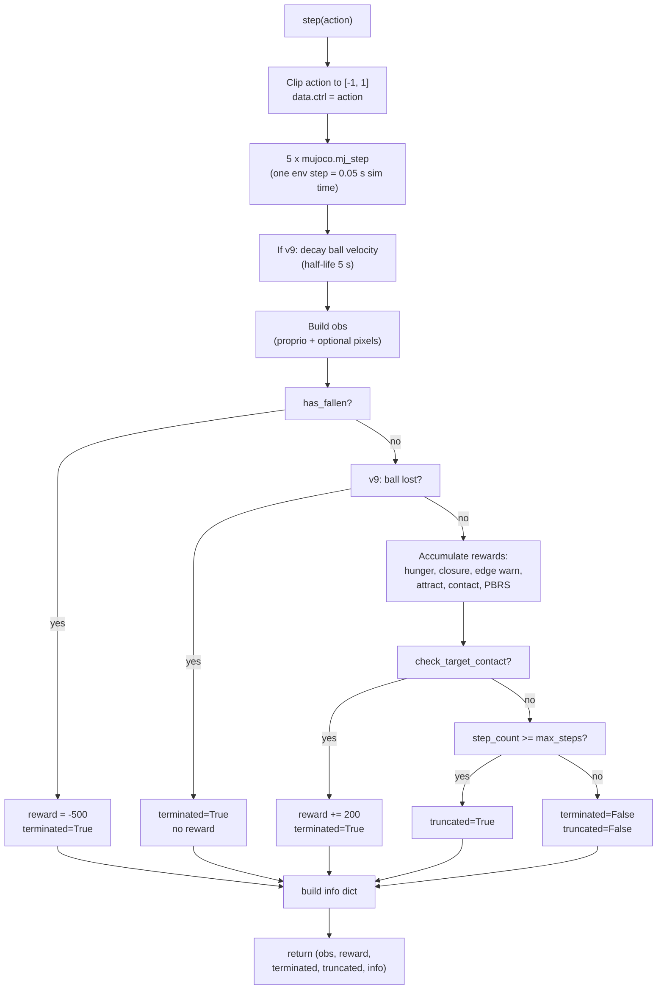

Some operational details worth naming: the fall check is a single inequality on the torso's world-frame z coordinate (`torso_z < PLATFORM_Z - 0.2`). Contact is detected by iterating MuJoCo's contact list and checking whether any creature-body geom is touching the target geom. Any body part counts — hand, wheel, torso edge — which matches the Taylor frame (contact is contact; a fingertip touch is not privileged over a torso bump).

---

## 9. Version evolution and the recurring pattern

This section tracks the research arc from v1 to v9 and surfaces a pattern the user has named explicitly. The claims here are drawn directly from `FINDINGS.md` and `PROJECT_STATUS.md`; no interpretation is added beyond what those documents already record.

### 9.1 Timeline

```mermaid
flowchart LR
    V1["v1: staged<br/>tabletop arm<br/>CKA = 0.033<br/>(vision destroyed proprio)"] --> V2
    V2["v2: frozen follow-on<br/>proprio drift = 0<br/>noise robustness 80%"] --> V3
    V3["v3: blind proprio<br/>removed target offset<br/>made vision necessary"] --> V4
    V4["v4: minor variant"] --> V5
    V5["v5: consistency loss<br/>CKA = 0.998<br/>HEADLINE: interpenetration"] --> V6
    V6["v6: gaze camera<br/>CKA = 0.992 preserved<br/>gaze behavior did NOT emerge"] --> V7
    V7["v7: moving targets<br/>+ narrow FOV<br/>gaze still underdetermined"] --> V8
    V8["v8: platform creature<br/>survival grounding<br/>0 falls, touch ~7/20<br/>vision sensitivity ~0.17"] --> V9
    V9["v9: moving ball<br/>+ mirror wrapper<br/>(in progress)"]
```

### 9.2 Where each version landed

A brief reading of what each version aimed at and what it found.

- **v1 — staged.** First attempt. Trained proprio, then added vision and let SAC retrain everything. CKA of hidden-1 activations between pre-vision and post-vision on proprio-only inputs: 0.033. Initially framed as interpenetration; later reinterpreted as obliteration (see section 4).
- **v2 — frozen follow-on.** Froze stage-1 weights during stage-2 vision training. Proprio-column drift went to zero by construction. Noise robustness jumped from ~45% to ~80% at 100% vision noise.
- **v3 — blind proprio.** Removed the target-position vector from proprioception, forcing vision to actually matter. A linear-regression probe on the hidden state recovered target location at R² = 0.35 — vision was providing real information.
- **v4 — minor variant.** Scaffolding.
- **v5 — consistency loss.** Added the `lambda * MSE(h_full, h_blind)` term to the actor loss. CKA rose to 0.998. Noise robustness held at 80%. This is the current project's headline empirical claim, and the core architectural piece that all later versions still inherit.
- **v6 — gaze camera.** Added a pan/tilt head so the camera could be aimed. CKA preserved at 0.992 (the consistency mechanism still worked through a movable camera). But the *behaviour* of actively looking at the target — gaze-tracking — did not emerge, despite the architecture allowing it. The first clear case of "mechanism works at the representation level but the behaviour it was supposed to unlock does not appear."
- **v7 — moving targets and narrower FOV.** Added environmental pressure (the target moves after spawn; FOV narrowed to 25 degrees) to force gaze to become instrumental. Gaze behaviour remained underdetermined. Developmental metrics were added to the eval pipeline so the diagnostic could run again in v8.
- **v8 — platform creature.** The survival-grounded body: 2 m platform, fall penalty, hunger, edge warning, rolling wheels, paddle-arm locomotion. Body physics is now stable (0 falls, 7/20 touches from blind paddling). But vision-ablation sensitivity is ~0.17 — the vision-added policy conditions on pixels but does not *steer* by them. Forward-paddle-and-hope resolves enough of the task that vision has not become necessary.
- **v9 — moving ball and mirror wrapper.** The current active branch. Moving ball removes the blind-paddle equilibrium; mirror wrapper removes the lateralisation attractor. Run in progress.

### 9.3 The recurring pattern

Five of the eight versions above show something like the same shape:

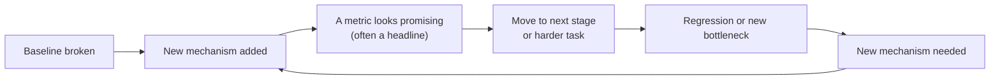

Specific instances (no editorial, just the record):

- v1 showed CKA = 0.033 and initially framed it as a headline success; reinterpretation reversed the conclusion.
- v5 showed CKA = 0.998 as the clean headline — but on the tabletop task only, which the creature solves without needing to see.
- v6 preserved CKA at 0.992 under a gaze camera — but the gaze behaviour the camera was meant to unlock did not emerge.
- v7 added environmental pressure — gaze still underdetermined.
- v8 solved body physics (0 falls, stable posture) — but vision-ablation sensitivity stalled at ~0.17 and the creature solves the task by paddling.
- Across v1, v6, and v8 there is a separate recurring issue: **late-training regression**. Best-checkpoint performance is often 3–5× better than final-checkpoint performance. SAC peaks around 30–40% of training and then degrades. Current mitigation is to always deploy `best_model.zip` rather than the final checkpoint. Root cause is still unknown.

The closing observation, which the user has flagged as the setup for a follow-on conversation: **each mechanism addresses the obstacle it was designed for, and the next stage reveals a new obstacle the prior mechanism did not cover.** Whether this is the normal shape of progress in a research project of this type, or whether the field already has standard practices that would have collapsed several of these cycles into one, is the question the follow-on aims to answer.

### 9.4 Open questions handed to the follow-on conversation

For completeness, the three questions the user wants the next conversation to pick up:

1. Has the locomotion-to-contact task been solved in the public RL literature already, and if so, what body / reward / curriculum choices are standard?
2. What symmetry, augmentation, or architectural choices are standard practice for bilateral embodied agents? In particular, is per-episode mirror augmentation treated as a given (rather than a patch), and if so, why was it not applied from v1?
3. Has Taylor's theory of perception — or something isomorphic to it — been operationalised in some other experimental programme, and what did that programme find?

---

## 10. Glossary and further reading

The existing `alien_baby/GLOSSARY.md` already defines over 50 terms spanning reinforcement learning (SAC, actor, critic, PBRS, entropy coefficient), neural network plumbing (MLP, ReLU, CKA), representation analysis (linear probe, neighbor consistency, equivalence class), simulation (MuJoCo, joint, free joint, quaternion), and Taylor's theory (Pi, equivalence class, interpenetration, engram). It is the authoritative reference; this document does not duplicate it.

For the research arc and current state, read in this order:

- `alien_baby/README.md` — the one-page pitch; where this started.
- `alien_baby/FINDINGS.md` — the experimental record; how we know what we know.
- `alien_baby/PROJECT_STATUS.md` — the current-state snapshot; where we are right now.
- `alien_baby/GLOSSARY.md` — reference for any unfamiliar term.

For the theory:

- `alien_baby/docs/Alien Baby.docx` — the formal write-up.
- `alien_baby/docs/greek_room.png` — the project's version of Searle's Chinese Room: a Greek Room whose inhabitants process symbols without equivalence classes to anchor them.
- `alienbaby.md` (at the repository root) — long-form expository essay.
- `On Agents.txt` (at the repository root) — notes connecting the project's framing to broader agent / storytelling theory.

---

*End of architectural review. Follow-on conversation: literature survey on prior art — locomotion-to-contact tasks, bilateral-agent symmetry augmentation, and experimental operationalisations of Taylor's perception theory.*
